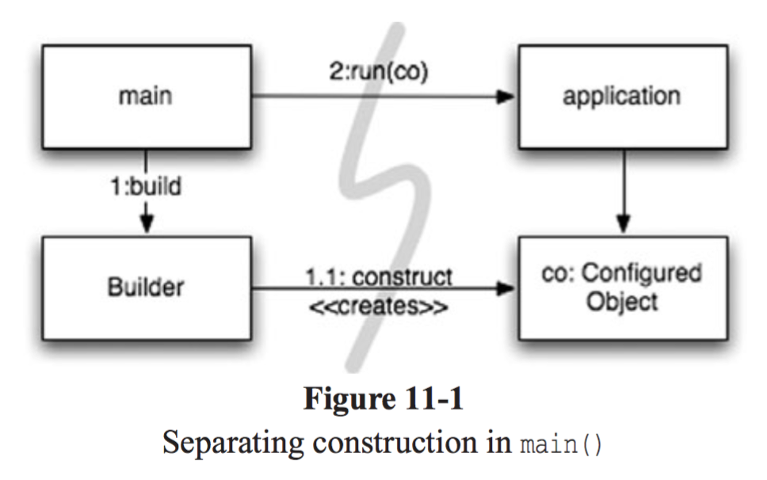
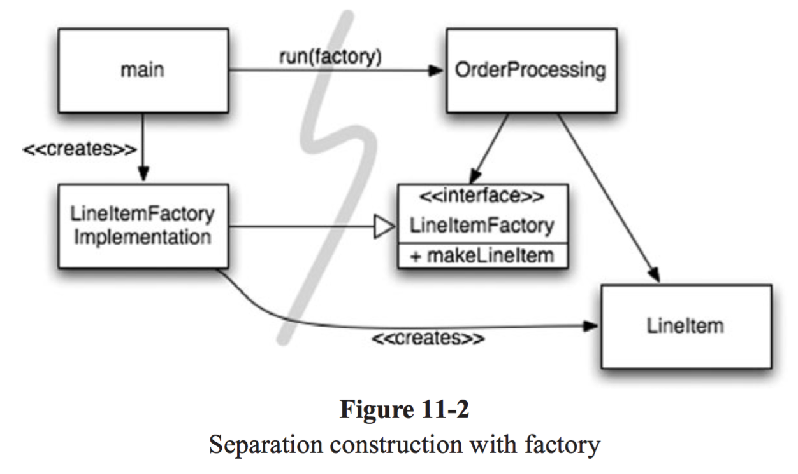

# 11장. 시스템

## 도시를 세운다면?
혼자서 불가능  
각 분야를 관리하는 팀이 존재, 적절한 추상화와 모듈화로 도시는 돌아간다.  
소프트웨어 팀도 도시처럼 구성한다.  
<br/>

## 시스템 제작과 시스템 사용을 분리하라
```
소프트웨어 시스템은 (애플리케이션 객체를 제작하고 의존성을 서로 '연결'하는) 준비 과정과 (준비 과정 이후에 이어지는) 런타임 로직을 분리해야 한다.
```  
```java
public Service getService() {
    if(service == null)
        service = new MyServiceImpl(...); // 모든 상황에 적합한 기본값일까?
    return service;
}
```  
시작 단계라는 관심사를 분리하지 않아,  
준비 과정 코드를 주먹구구식으로 구현하고 런타임 로직과 마구 뒤섞인 전형적인 예  
* 초기화 지연(Lazy Initialization) 또는 계산 지연(Lazy Evaluation) 기법  
  __(장점)__  
  필요할 때까지 객체를 생성하지 않으므로 불필요한 부하가 걸리지 않음  
  애플리케이션 시작 시간이 빨라짐  
  어떤 경우에도 null 포인터를 반환하지 않음  
  __(단점)__  
  getService 메서드가 MyServiceImpl과 생성자 인수에 명시적으로 의존함  
  MyServiceImpl이 무거운 객체라면 단위 테스트에서 getService 메서드를 호출하기 전에 적절한 테스트 전용 객체를 service 필드에 할당해야 함  
  -> `단일 책임 원칙(Single Responsibility Principle, SRP) 위배`  
  MyServiceImpl이 모든 상황에 적합한 객체인지 모름  
<br/>

체계적이고 탄탄한 시스템을 만들고 싶다면 모듈성을 깨면 안됨  
설정 논리는 일반 실행 논리와 분리해야 모듈성이 높아진다.  
또한 주요 의존성을 해소하기 위한 방식, 즉 전반적이며 일관적인 방식도 필요함  
<br/>

* Main 분리  
  시스템 생성과 시스템 사용을 분리하는 한 가지 방법  
  생성과 관련된 코드는 모두 main 이나 main이 호출하는 코드로 옮기고, 나머지 시스템은 모든 객체가 생성되었고 모든 의존성이 연결되었다고 가정한다.  
    
  - main 함수에서 시스템에 필요한 객체를 생성한 후 애플리케이션에 넘긴다.  
    애플리케이션은 그저 객체를 사용할 뿐.  
  - 모든 화살표가 main 쪽에서 애플리케이션 쪽을 향한다.  
    즉, 애플리케이션은 main이나 객체가 생성되는 과정을 전혀 모른다는 뜻.  
<br/>

* 팩토리  
  때로는 객체가 생성되는 시점을 애플리케이션이 결정할 필요도 생긴다.  
    
  - 주문처리 시스템에서 애플리케이션은 LineItem 인스턴스를 생성해 Order에 추가한다.  
  - ABSTRACT FACTORY 패턴 사용
  - LineItem을 생성하는 시점은 애플리케이션이 결정하지만 LineItem을 생성하는 코드는 모른다.
  - 필요하다면 OrderProcessing 애플리케이션에서만 사용하는 생성자 인수도 넘길 수 있다.  
<br/>

* 의존성 주입(Dependency Injection)  
  제어 역전 기법을 의존성 관리에 적용한 메커니즘  
  제어 역전에서는 한 객체가 맡은 보조 책임을 새로운 객체에서 전적으로 떠넘김 -> `단일 책임 원칙(Single Responsibility Principle, SRP)`  
  의존성 관리 맥락에서 객체는 의존성 자체를 인스턴스로 만드는 책임은 지지 않는다. 대신에 이런 책임을 다른 '전담' 메커니즘에 너겨야만 한다.  
  그렇게 함으로써 제어를 역전한다.  
  초기 설정은 시스템 전체에서 필요하므로 대개 '책임질' 메커니즘으로 'main' 루틴이나 특수 컨테이너를 사용한다.  
  JNDI 검색은 의존성 주입을 '부분적으로' 구현한 기능임  
  객체는 디렉터리 서버에 이름을 제공하고 그 이름에 일치하는 서비스를 요청함  
  ```java
    MyService myService = (MyService)(jndiContext.lookup("NameOfMyService"));
  ```  
  호출하는 객체는 반환되는 객체의 유형을 제어하지 않는 대신 호출하는 객체는 의존성을 능동적으로 해결함  
  <br/>

  더 나아가 설정자(setter) 메서드나 생성자 인수를 제공한다.  
  DI 컨테이너는 필요한 객체의 인스턴스를 만든 후 생성자 인수나 설정자 메서드를 사용해 의존성을 설정한다.  
  <br/>

  스프링 프레임워크는 가장 널리 알려진 자바 DI 컨테이너를 제공함  
  객체 사이 의존성은 XML 파일에 정의하여 코드에서 이름으로 특정한 객체를 요청한다.  
  대다수 DI 컨테이너는 필요할 때까지는 객체를 생성하지 않고, 대부분은 계산 지연이나 비슷한 최적화에 쓸 수 있또록 팩토리를 호출하거나 프록시를 생성하는 방법을 제공한다.  
  즉, 계산 지연 기법이나 이와 유사한 최적화 기법에서 이런 메커니즘을 사용할 수 있다.  
  <br/>

## 확장
'처음부터 올바르게' 시스템을 만들 수 없다.  
테스트 주도 개발, 리팩터링을 통한 깨끗한 코드는 코드 수준에서 시스템을 조정하고 확장하기 쉽게 만든다.  
```
소프트웨어 시스템은 물리적인 시스템과 다르다.
관심사를 적절히 분리해 관리한다면 소프트웨어 아키텍처는 점진적으로 발전할 수 있다.
```  
<br/>

* 횡단(cross-cutting) 관심사  
  관점 지향 프로그래밍(Aspect-Oriented Programming, AOP)는 횡단 관심사에 대처해 모듈성을 확보하는 일반적인 방법론  
  관점이라는 모듈 구성 개념은 "특정 관심사를 지원하려면 시스템에서 특정 지점들이 동작하는 방식을 일관성 있게 바꿔야 한다"라고 명시함  
<br/>

## 자바 프록시
자바 프록시는 단순한 상황에 적합하다. (ex. 개별 객체나 클래스에서 메서드 호출을 감싸는 경우)  
클래스 프록시를 사용하려면 CGLIB, ASM, Javassist 등과 같은 바이트 코드 처리 라이브러리가 필요하다.
코드 양과 크기는 프록시의 단점이다.  
다시 말해, 프록시를 사용하면 깨끗한 코드를 작성하기 어렵다!  
또한 시스템 단위로 실행 '지점'을 명시하는 메커니즘도 제공하지 않는다.  

## 순수 자바 AOP 프레임워크
스프링 AOP, JBoss AOP 등과 같은 여러 자바 프레임워크는 내부적으로 프록시를 사용한다.  
POJO(Plain Old Java Object)는 순수하게 도메인에 초점을 맞추고 엔터프라이즈 프레임워크나 다른 도메인에 의존하지 않는다.  
따라서 테스트가 개념적으로 더 쉽고 간단하다.  
상대적으로 단순하기 때문에 사용자 스토리를 올바로 구현하기 쉬우며 미래 스토리에 맞춰 코드를 보수하고 개선하기 편하다.
<br/>

## AspectJ 관점
언어 차원에서 관점을 모듈화 구성으로 지원하는 자바 언어 확장  
관점을 분리하는 강력하고 풍부한 도구 집합을 제공하지만, 새 도구를 사용하고 새 언어 문법과 사용법을 익혀야 한다는 단점 존재  
<br/>

## 테스트 주도 시슽메 아키텍처 구축
코드 수준에서 아키텍처 관심사를 분리할 수 있다면, 진정한 테스트 주도 아키텍처 구축이 가능해진다.  
BDUF(Big Design Up Front) 방식을 추구할 필요 없다.  
(소프트웨어 나름 형체가 있지만, 관점을 효과적으로 분리한 구조라면 극적인 변화가 가능하기 때문)  
=> 단순하게 분리된 아키텍처로 결과물을 빠르게 출시한 후, 기반 구조를 추가하며 조금씩 확장해 나가도 괜찮다  
```
최선의 시스템 구조는 각기 POJO 객체로 구현되는 모듈화된 관심사 영역(도메인)으로 구성된다.
이렇게 서로 다른 영역은 해당 영역 코드에 최소한의 영향을 미치는 관점이나 유사한 도구를 사용해 통합한다.
이런 구조 역시 코드와 마찬가지로 테스트 주도 기법을 적용할 수 있다.
```  
<br/>

## 의사 결정을 최적화하라
때떄로 가능한 마지막 순간까지 결정을 미루는 방법이 최선이다.  
-> 최대한 정보를 모아 최선의 결정을 내리기 위해  
<br/>

## 명백한 가치가 있을 때 표준을 현명하게 사용하라
표준을 사용하면 아이디어와 컴포넌트를 재사용하기 쉽고, 적절한 경험을 가진 사람을 구하기 쉬우며, 좋은 아이디어를 캡슐화하기 쉽고, 컴포넌트를 엮기 쉽다.  
하지만 때로는 표준을 만드는 시간이 너무 오래 걸려 업계가 기다리지 못한다.  
어떤 표준은 원래 표존을 제정한 목적을 잊어버리기도 한다.  
<br/>

## 시스템은 도메인 특화 언어가 필요하다
DSL(Domain-Specific Language) : 간단한 스크립트 언어나 표준 언어로 구현한 API  
좋은 DSL은 도메인 개념과 그 개념을 구현한 코드 사이에 존재하는 '의사소통 간극'을 줄여준다.  
효과적으로 DSL을 사용할 경우 추상화 수준을 코드 관용구나 디자인 패턴 이상으로 끌어올린다.  
<br/>

## 결론
모든 추상화 단계에서 의도는 명확히 표현해야 한다.  
시스템이 돌아가는 가장 단순한 수단을 사용해야 한다.  
